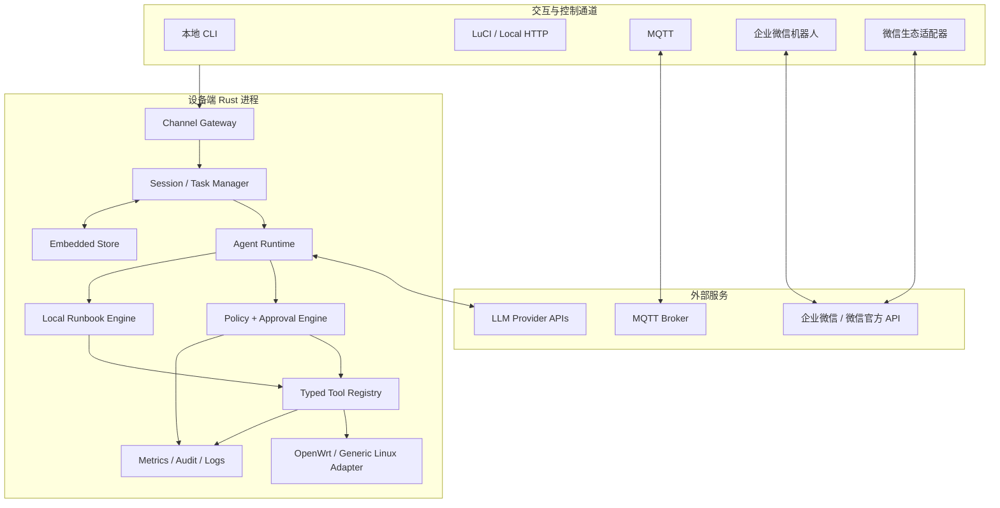

# Mbed Agent：面向 OpenWrt 与小型嵌入式 Linux 的智能网络 Agent 实现方案

> 文档状态：架构草案 v0.4
> 更新日期：2026-07-25
> 项目仓库：<https://github.com/jian-yu/mbed-agent>
> 目标读者：产品负责人、OpenWrt 工程师、Rust 工程师、云平台与安全工程师

## 1. 执行摘要

Mbed Agent 定位为运行在 OpenWrt、Buildroot、Yocto 等小型嵌入式 Linux 设备上的专业网络运维 Agent。它不是把通用聊天机器人简单塞进路由器，而是一个“设备本地确定性控制面 + 可替换 LLM 推理面”的系统：本地侧采集状态、执行诊断、验证配置、管理权限、保存审计记录和完成故障回滚；LLM 负责理解自然语言、选择诊断路径、解释证据和提出结构化操作计划。

首版建议只发布一个 Rust 可执行程序 `mbed-agent`：`daemon` 子命令运行守护进程，其他子命令作为本地 CLI；另有可选的 LuCI，以及按需加载的工具和 Channel 适配器。核心运行时保持单进程、有限并发、无动态插件装载；扩展采用编译期 feature、声明式 Skill/Runbook 和受控外部程序三种方式。企业微信和微信官方 Channel 由设备直接连接，不依赖项目自建云端中继；CLI 负责显示官方授权二维码并完成绑定。设备侧不运行大模型，默认通过 HTTPS 使用远端模型；在资源较充足的边缘网关上，也可通过 OpenAI-compatible 接口连接本地推理服务。

本方案采用严格的易失运行时：除 `/etc/config/*` 与 `/etc/mbed-agent/` 下的配置、Channel 绑定凭据外，Agent 运行产生的会话、任务、审计、快照、日志和附件一律不得写入 Flash。唯一数据库为 `/tmp/mbed-agent/agent.db` 中的 SQLite；守护进程重启时可继续使用同一次开机内的数据，整机重启或断电后无需恢复。

推荐首先实现“只读诊断闭环”，再实现“通用安全配置闭环”，最后扩展自动修复和业务增强。配置面不局限于少数预设用例：在平台能力可探测、输入可强类型校验、影响可预览、结果可验证且失败可回滚的前提下，应最大限度开放防火墙、网络、DNS/DHCP、无线、路由、服务与 QoS 等专业配置能力。无法可靠建立这些安全条件的动作必须降级为只读建议或拒绝执行，不能退化为任意 root shell。首个可用版本重点覆盖 WAN 无法上网、DNS 异常、DHCP/地址冲突、Wi-Fi 接入问题、路由与防火墙错误、性能退化六类高频场景。

### 1.1 已确认的产品约束

1. 企业微信使用官方智能机器人能力；个人微信明确使用腾讯微信 ClawBot/iLink Bot 能力。二者均由设备直连，CLI 展示官方授权二维码完成绑定，凭据自动保存为配置，daemon 启动后自动连接全部已绑定 Channel。
2. Agent 运行时除配置文件和 Channel 绑定凭据外不得写 Flash；OpenWrt 业务配置变更也是受策略保护的配置写入。
3. 唯一数据库为 SQLite，固定使用 `/tmp/mbed-agent/agent.db`，无需跨设备重启或断电恢复。
4. 任意 Channel 的 actor 均可通过设备管理员密码校验，短时提升为 `device-admin`；密码校验完全在设备本地完成。
5. `/tmp` 使用必须具有可配置的分项限额、总限额和剩余空间保护；日志等级、格式、单条大小、轮转文件大小和总量均可配置。
6. 所有专业能力都应同时评估“观察、计划、配置、验证、回滚”五种能力，不得因首个用例简单而把实现固化成单用途命令；在风险可控范围内采用能力探测驱动的最大可配置原则。

## 2. 产品定位与边界

### 2.1 核心角色

Agent 的系统角色应固定为：

1. Linux 网络专家：理解接口、路由、邻居表、DNS、DHCP、VLAN、Bridge、PPPoE、IPv4/IPv6、NAT、nftables/iptables、QoS、隧道和常见 VPN。
2. OpenWrt 工程师：优先通过 ubus、UCI、netifd、procd、logd、rpcd、firewall4、dnsmasq/odhcpd 等原生机制工作，而不是盲目改写配置文件。
3. 谨慎的设备操作员：先观察、再假设、再验证；变更前生成计划和快照，变更后执行健康检查，失败则自动回滚。
4. 可解释的故障分析器：结论必须引用本次采集到的证据，区分“事实、推断、建议”，不得伪造命令输出。

### 2.2 目标用户

- 家庭与小微企业路由器用户：通过自然语言排障和配置。
- CPE/AP/工业网关厂商：嵌入固件，提供远程运维和增值服务。
- MSP/运营商：通过 MQTT 管理大量设备，执行带审计的诊断或修复任务。
- OpenWrt 开发者：通过 CLI 快速收集环境、复现问题、生成脱敏诊断包。

### 2.3 首期做什么

- 设备与网络状态盘点、持续健康检查。
- 基于证据的多步故障诊断。
- UCI 配置查询、差异预览、验证、提交和回滚。
- 网络连通性、DNS、路由、接口、无线、DHCP、防火墙诊断。
- 通过统一 ChangeSet 配置防火墙策略、接口/地址、Bridge/VLAN、路由、
  DNS/DHCP、无线、受控服务和 QoS；具体可写字段由平台 capability 与本地策略共同决定。
- 本地 CLI、MQTT、企业微信智能机器人、微信 ClawBot 等 Channel 接入。
- OpenAI、Anthropic、Gemini、OpenAI-compatible 等模型接入。
- 会话、任务、审计和少量知识写入 `/tmp` 中的易失 SQLite，不跨设备重启恢复。

### 2.4 首期明确不做

- 不在 64/128 MB 级设备本地运行通用大模型。
- 不允许 LLM 直接获得不受限 root shell。
- 不以完整 MCP Host 作为设备端首发依赖；设备资源足够时再作为可选 feature。
- 不在首版实现任意第三方动态库插件，避免 ABI、供应链和内存不可控。
- 不承诺替代专业抓包分析、射频测试或运营商线路侧诊断系统。
- 不承诺“任何配置都能写”：未知 schema、无法生成 diff、无法验证、
  无法建立回滚或会越过项目托管边界的配置只读展示，不交给 LLM 以
  raw nft/iptables/UCI 参数或任意文件编辑方式执行。

## 3. 设计原则

1. **Local-first control**：配置、权限、审计、执行和回滚均在设备本地掌控；企业微信/微信不依赖项目云中继。
2. **LLM is untrusted planner**：模型输出永远是候选计划，不是命令授权。
3. **Typed tools over shell**：优先使用有 JSON Schema、超时、输出上限和风险等级的强类型工具。
4. **Read before write**：任何变更都必须基于刚采集的设备状态，并带前置条件。
5. **Transactional change**：配置修改采用 snapshot → stage → validate → commit → probe → confirm/rollback。
6. **Bounded resources**：所有队列、输出、历史、并发、重试、日志和数据库都有硬上限。
7. **Offline-degradable**：模型不可用时，本地 Runbook、健康检查、CLI 和同一次开机内的回滚仍可工作。
8. **Volatile by default**：除配置与 Channel 凭据外，运行态只进入 RAM-backed `/tmp`，不写 Flash。
9. **Provider/channel neutral**：核心领域模型不依赖某家 LLM 或消息平台的数据结构。
10. **Least privilege**：把诊断与变更分级，默认只读，危险操作需要明确授权。
11. **Evidence-driven**：每个诊断结论都可追溯到 Tool Observation。
12. **Maximal safe configurability**：不是只实现少数固定按钮；每个领域提供
    完整 typed CRUD 和 capability contract，但只执行本机能够安全验证与回滚的子集。
13. **Managed ownership**：普通 Linux 上只修改 Agent 明确创建并标记所有权的
    table、chain、set、配置片段和服务 drop-in；已有第三方对象默认只读。

## 4. 总体架构



### 4.1 推荐部署形态

**A. 纯设备直连模式（本项目默认）**：设备通过 HTTPS 直连 LLM，通过官方 API/WSS 直连企业微信或微信开放能力，CLI/LuCI 与 Agent 通信。API Key 与 Channel 绑定凭据作为配置保存在 root-only 配置目录。弱设备需要承担 TLS 长连接成本，应在 Phase 0 实测。

**B. MQTT 管理模式**：设备可同时连接指定 MQTT Broker，供批量设备管理或自有业务使用。MQTT 不是企业微信/微信的中继，Channel 仍由设备直接接入。模型是否经过用户自己的兼容代理是独立配置，不改变 Channel 架构。

**C. 局域网推理模式**：设备连接 LAN 内 Ollama、vLLM、llama.cpp server 或其他 OpenAI-compatible 服务。适合隐私环境和较强的边缘服务器。

三种形态使用相同的 `ModelProvider` 与消息协议，不分叉 Agent 核心。任何项目自建云 Relay 均不属于必需组件。

## 5. Rust Workspace 与模块划分

建议采用 Cargo workspace，但避免过度拆 crate。首期保持约 10–12 个边界清楚的 crate：

```text
mbed-agent/
├── Cargo.toml
├── crates/
│   ├── mbed-agent/           # 单一程序：daemon composition root + Unix socket CLI
│   ├── agent-core/           # Agent loop、任务状态机、context 管理
│   ├── agent-protocol/       # Provider/Channel/Tool 共享 DTO 与版本化协议
│   ├── agent-policy/         # 风险、权限、审批、配额、脱敏
│   ├── agent-tools/          # 工具注册表与通用 Linux 工具
│   ├── platform-linux/       # 通用 Linux 基线 + OpenWrt 专用适配
│   ├── platform-linux/       # /proc、/sys、netlink、通用发行版适配
│   ├── agent-providers/      # 各 LLM API 适配
│   ├── agent-channels/       # MQTT/webhook/local channel 适配
│   ├── agent-store/          # /tmp 中唯一的 SQLite 易失存储
│   └── agent-runbook/        # 声明式诊断流程解释器
├── skills/                   # 网络领域 Skill/知识，随包安装
├── runbooks/                 # 可离线运行的确定性流程
├── openwrt/                  # OpenWrt package Makefile、procd、UCI 默认配置
├── config/                   # 示例与 JSON Schema
├── tests/                    # 仿真、协议和端到端测试
└── docs/
```

`agent-protocol` 不依赖具体网络客户端或数据库；`agent-core` 只依赖 trait；二进制 crate 决定启用哪些 provider/channel feature。借鉴现代 Agent 项目的可取之处是“运行时、工具、工作区/平台、UI/Channel、配置彼此解耦”，而不是复制面向桌面的庞大 TUI 或任意 shell 权限模型。Grok Build 的公开仓库也将 runtime、tools、workspace 和 TUI 分 crate；OpenCode 强调 session、tool、provider 与权限配置，这些边界值得吸收。

## 6. Agent 运行时

### 6.1 核心状态机

一次请求表示为写入易失 SQLite 的 `Task`，而不是一个不可观测的 async 调用。它可以在守护进程重启后于同一次开机内被清理或恢复调度，但不承诺跨整机重启恢复：

```text
Received → Classifying → Planning → AwaitingApproval? → Executing
         → Observing → Replanning? → Summarizing → Completed
                    ↘ Failed / Cancelled / RolledBack
```

主要对象：

- `Session`：用户与设备范围内的多轮上下文。
- `Task`：一次明确目标，拥有 deadline、预算、发起方和状态。
- `Turn`：一轮模型交互。
- `ToolCall`：结构化工具请求，含 risk、approval、timeout、idempotency key。
- `Observation`：工具输出的结构化、截断、脱敏版本。
- `ChangeSet`：一个或多个可验证、可回滚的配置动作。
- `Artifact`：诊断包、抓包摘要、配置 diff 等大对象的引用。

### 6.2 Agent Loop

1. Channel 输入先规范化为 `InboundMessage`，绑定 actor、tenant、device、session。
2. 意图分类器优先使用本地规则识别简单查询、固定 Runbook 和紧急回滚；复杂请求才调用 LLM。
3. Context Builder 按需加入设备画像、相关 Skill、近期摘要、工具定义和本次观察，不发送整机配置。
4. Provider 返回文本或 Tool Call 流；协议适配器统一为内部事件。
5. Tool Call 经过 schema 校验、策略检查、审批判定、预算检查与参数脱敏。
6. Tool Executor 执行并生成 Observation；运行时决定继续调用模型、走确定性 Runbook，或结束。
7. 终止时生成用户答案和机器可读 Result，保存摘要、用量与审计事件。

### 6.3 硬限制

默认建议值，可通过设备档位覆盖：

| 限制项 | Tiny（64–128 MB） | Standard（256 MB+） |
|---|---:|---:|
| 同时活跃任务 | 1 | 2–4 |
| 单任务工具步数 | 12 | 24 |
| 单工具 stdout/stderr | 各 16 KiB | 各 64 KiB |
| 单任务墙钟时间 | 120 s | 300 s |
| HTTP 响应体 | 2 MiB | 8 MiB |
| 内存中消息历史 | 最近 6 轮 + 摘要 | 最近 12 轮 + 摘要 |
| Channel 入站队列 | 32 | 128 |
| 抓包默认上限 | 2 MiB / 15 s | 10 MiB / 30 s |

工具超时后先发送 SIGTERM，再在短暂 grace period 后 SIGKILL；子进程使用独立进程组，防止遗留后台进程。所有流式解析均施加 frame/body 上限。

### 6.4 并发模型

采用 Tokio 单运行时、多任务协作；Tiny 默认 1 个 worker thread，Standard 可用 2 个。避免为每个 Channel 创建独立 runtime。阻塞命令执行通过受限 `spawn_blocking` 或单独 supervisor 完成，并用 semaphore 限制并发。内部事件总线采用有界 `tokio::sync::mpsc`，禁止无界 channel。

## 7. 专业网络能力设计

### 7.1 工具不是命令别名

每个工具包含：名称、用途、输入 JSON Schema、输出类型、风险等级、平台要求、超时、最大输出、幂等性、是否需要网络、脱敏规则、回滚策略。示例：

```json
{
  "name": "network.route.lookup",
  "description": "查询内核对指定目的地址实际选择的出口、下一跳和源地址",
  "risk": "read_only",
  "input_schema": {
    "type": "object",
    "properties": { "destination": { "type": "string" } },
    "required": ["destination"],
    "additionalProperties": false
  }
}
```

首批工具域：

- `system.*`：版本、时间、负载、内存、存储、进程、内核日志。
- `network.interface.*`：link/address/stats/carrier/ethtool 摘要。
- `network.route.*`：路由表、policy rule、route get。
- `network.neighbor.*`：ARP/NDP、冲突线索。
- `network.dns.*`：配置、逐级解析、指定 resolver、dnsmasq 状态。
- `network.connectivity.*`：ping、TCP connect、TLS/HTTP probe、MTU 探测。
- `network.socket.*`：监听与连接摘要。
- `openwrt.ubus.*`：受 allowlist 限制的 object/method 调用。
- `openwrt.uci.*`：show/get、stage diff、validate、commit/rollback。
- `openwrt.wireless.*`：radio/SSID/association/survey 摘要。
- `openwrt.dhcp.*`：租约、odhcpd/dnsmasq 状态。
- `openwrt.firewall.*`：zone、forwarding、rule、nft counters 与 trace 摘要。
- `capture.*`：限时限量 tcpdump，默认只返回元数据和分析摘要。
- `service.*`：状态、reload/restart（变更级权限）。

### 7.2 平台数据源优先级

OpenWrt 下优先顺序为：ubus API → UCI → netlink/procfs/sysfs → 受控系统命令 → 原始配置文件。这样既遵循 OpenWrt 控制面，又能兼容裁剪固件。启动时执行 capability discovery，记录当前系统实际具备的 ubus object、命令、内核模块和服务，随后只向模型暴露可用工具。

### 7.3 Runbook

LLM 自由规划适合长尾问题，但高频故障应使用可测试的确定性 Runbook。Runbook 采用版本化 YAML，节点类型只包括 probe、branch、tool、assert、approval、change-set、wait、rollback 和 summarize；表达式语言保持极小，不允许任意脚本。

以“WAN 无法上网”为例：

1. 读取 WAN logical interface 和关联 device。
2. 检查 carrier、协议状态、地址、默认路由和 DNS。
3. 分层探测网关、公共 IP、DNS 解析、HTTPS。
4. 根据证据区分物理链路、拨号/DHCP、路由、DNS、防火墙、上游问题。
5. 只在用户允许时执行 renew/reload/restart 或配置修复。
6. 复测相同探针并输出前后差异。

LLM 的作用是选择 Runbook、补充参数、解释结果和处理未覆盖分支；基础判断不必每一步消耗 token。

### 7.4 网络知识 Skill

Skill 是按需注入的 Markdown + metadata，内容包括诊断原则、OpenWrt 版本差异、厂商平台限制和输出格式。首批建议：

- `linux-network-basics`
- `openwrt-network-uci`
- `openwrt-firewall4-nftables`
- `wifi-client-diagnostics`
- `dns-dhcp-diagnostics`
- `pppoe-and-wan`
- `ipv6-diagnostics`
- `wireguard-diagnostics`

Skill 必须有版本、适用平台范围、token 估算和签名摘要；只注入与任务匹配的 Skill，避免一个巨型 system prompt。

### 7.5 通用安全配置面

配置能力采用“广领域 typed model + 平台 capability 裁剪”，而不是为“限制一个
MAC”之类的单一需求增加专用脚本。每个配置对象至少支持 `inspect`、`plan_create`、
`plan_update`、`plan_delete`、`validate` 和 `verify`；支持重排的对象还提供
`plan_move`。模型只能填充领域对象，不能提供 executable、argv、UCI section
表达式、nft statement 或配置文件路径。

首批配置能力矩阵如下。表中的“最大范围”是产品目标；设备实际暴露的写能力必须
取该范围、本机 `PlatformCapabilities`、本地 policy allowlist 和当前 actor 权限的交集。

| 领域 | 最大 typed 配置范围 | OpenWrt 后端 | 普通 Linux 后端 | 主要限制 |
|---|---|---|---|---|
| 防火墙 | zone、默认策略、forwarding、filter rule、MAC/IP/CIDR、协议/端口、接口、address set、DNAT/SNAT/redirect、masquerade、启停、顺序 | `/etc/config/firewall` UCI，统一服务 fw3/iptables 与 fw4/nftables | Agent 专属 nft table/chain/set；无 nft 时使用专属 iptables chain/ipset | 不生成 raw expression；不自动改第三方 chain；涉及管理路径为 R3 |
| L2/L3 网络 | interface/device、静态/动态地址、MTU、MAC override、Bridge、VLAN、bond、VRF、默认/静态路由、policy rule | network UCI + netifd/ubus，按 swconfig/DSA capability 裁剪 | netlink 运行态；持久化仅通过识别出的 NetworkManager、systemd-networkd 或厂商受支持 adapter | 修改当前管理接口、默认路由或 LAN 地址为 R3；未知网络管理器只允许运行态或只读 |
| DNS | 上游 resolver、搜索域、split DNS、缓存参数、静态主机、DNSSEC 开关 | dhcp UCI + dnsmasq/odhcpd | systemd-resolved、NetworkManager 或 Agent 托管 dnsmasq 片段 | 不覆盖未知手工 `/etc/resolv.conf`；凭据型 DoH/DoT 参数按 secret 处理 |
| DHCP | 地址池、租期、静态租约、option、RA/DHCPv6 模式 | dhcp UCI + dnsmasq/odhcpd | Agent 托管 dnsmasq/odhcpd adapter | 地址池冲突、网段越界和管理地址冲突必须在 stage 阶段拒绝 |
| 无线 | radio 启停、国家码、信道/带宽/功率、SSID、模式、加密、密钥、网络绑定、隔离、MAC policy | wireless UCI + netifd/hostapd | 仅在识别并支持 hostapd/wpa_supplicant 管理方式时写 Agent 托管片段 | 扫描与配置分级；改管理 SSID/密钥为 R3；密钥不进 SQLite/日志/LLM |
| 服务 | reload/restart/start/stop、受支持服务的 enable/disable、有限 typed 参数 | ubus/procd/init script allowlist | systemd/OpenRC/BusyBox init adapter allowlist | 不接受任意 service 名；enable/disable 属于持久配置 |
| QoS/流控 | qdisc/class/filter、接口限速、DSCP 分类、SQM profile | sqm UCI 或受控 `tc` | Agent 托管 `tc` 对象，必要时使用受支持网络管理器持久化 | 只删除带 Agent ownership 的对象；CPU/带宽预算超限时拒绝 |
| VPN/隧道 | WireGuard interface/peer、路由与防火墙绑定；后续扩展受支持隧道 | network/firewall UCI | netlink/wg + Agent 托管配置 adapter | 私钥只存在 root-only 配置或外部密钥源；改变管理隧道为 R3 |
| 系统网络参数 | 明确 allowlist 的 sysctl、hostname、时区/NTP server | system UCI 或受支持配置 | sysctl.d/服务 adapter 的 Agent 托管片段 | 内核安全参数、包安装、固件升级不归入普通网络 ChangeSet |

“最大可配置”不等于“一次计划可无限修改”。单个 ChangeSet 必须设置对象数、diff
字节、snapshot 字节、执行步骤、墙钟时间和并发锁上限；Tiny 默认一次只允许一个
写事务。跨领域目标可以包含多个对象，但必须形成一个依赖图，例如新增访客 SSID
同时包含 wireless interface、VLAN/Bridge、DHCP pool、firewall zone、forwarding
和隔离规则，统一预览、审批、应用和回滚，不能留下半配置状态。

每个 typed 对象具有稳定 `object_id`、`desired_state`、`preconditions`、
`ownership` 和 `sensitive_fields`。更新和删除必须引用刚读取的对象版本或内容
摘要，避免 LLM 根据过期状态覆盖用户刚做的修改。创建对象使用 daemon 生成的
幂等键和可识别名称；重复提交不得产生重复规则、重复 VLAN 或重复 DHCP lease。

## 8. 安全、权限与防断网设计

### 8.1 风险级别

| 等级 | 含义 | 示例 | 默认策略 |
|---|---|---|---|
| R0 | 纯本地只读、低敏感 | 查看接口统计 | 自动允许 |
| R1 | 只读但可能泄露敏感信息/产生流量 | 配置读取、DNS/HTTP 探测 | 允许并脱敏/限速 |
| R2 | 可逆且不改变管理路径的局部变更 | 新增非管理网段规则、DHCP renew、服务 reload | `network-admin` 或 `device-admin`，审批绑定精确 diff |
| R3 | 可能中断管理连接或扩大暴露面 | 修改 WAN/LAN、默认路由、管理 SSID、防火墙默认策略、DNAT、停止服务 | 仅 `device-admin`，展示 diff，逐次审批，强制回滚计时器 |
| R4 | 高危或不可逆 | 升级固件、恢复出厂、修改认证、任意 shell | 默认禁止；未来专用工作流 |

风险不是仅按工具名静态决定。同一个防火墙 rule，新增访客网到互联网的受限
forwarding 可以是 R2，允许 WAN 访问管理端口则必须提升为 R3；删除规则、扩大
CIDR/端口范围、把 DROP 改为 ACCEPT、改变当前会话入站路径也会动态提高风险。
Policy Engine 必须对 typed diff 做语义比较，风险只能上调，不能由 LLM 指定或下调。

### 8.2 审批主体

内部 `Actor` 包含身份来源、角色、device scope、认证强度和授权失效时间。建议角色：viewer、operator、network-admin、device-admin。任何已配置 Channel（CLI、MQTT、企业微信、微信官方 Channel 等）中的用户都可以发起提权，不按 Channel 类型限制；成功校验设备管理员密码后，为当前 actor 签发 RAM 中的短时 `device-admin` capability。

建议交互为 `/elevate` → Agent 进入专用认证状态 → 用户提交管理员密码 → 本地认证器校验 → 返回授权范围与 TTL。认证消息必须绕过 LLM、普通消息队列、SQLite、日志、遥测和审计参数；只记录“actor 在何时认证成功/失败”，绝不记录密码或 hash。密码在解析后使用可清零内存容器，并在校验完成后立即覆盖。若 Channel 支持撤回消息，认证后尽力撤回，但不能把平台侧撤回视为安全保证。

OpenWrt 默认可由最小权限的本地认证 helper 使用系统 `crypt(3)`/shadow 语义校验管理员密码；具备 PAM 的通用 Linux 则使用 PAM。主 Agent 不把 `/etc/shadow` 内容传给工具、模型或 Channel。失败实行指数退避、并发锁和短时封禁，避免远程爆破。授权默认 5 分钟、只绑定 `channel + account/user id + conversation/device`，空闲或守护进程/整机重启即失效；用户可以 `/deauth` 主动撤销。

“Channel 不受限”表示所有 Channel 都能进入同一认证流程，不表示密码可以被平台安全地传输。对端到端保密不足、会长期保留聊天记录的 Channel，CLI 必须明确警告风险，并可选返回一次性本地 HTTPS/CLI challenge 供用户输入；最终校验仍发生在设备本地。

审批不是一句“同意”。Daemon 对规范化 ChangeSet、设备 boot id、actor、风险、
过期时间和当前对象版本计算摘要，签发短时、一次性的 approval token。应用时重新
读取状态并重算摘要；任何 diff、能力、对象版本、actor 或 boot id 变化都会使 token
失效并返回重新预览。Channel 的按钮、文本确认和 CLI 最终都只提交该 token，不得
自行构造已批准状态。

### 8.3 配置事务与回滚

OpenWrt 与普通 Linux 共用以下 ChangeSet 状态机：

```text
Draft → Planned → AwaitingApproval → Approved → Staged → Validated
      → RollbackArmed → Applying → Verifying → AwaitingConfirmation
      → Confirmed
      ↘ Rejected / Expired / ApplyFailed → RollingBack → RolledBack
```

1. 获取领域写锁，重新读取相关配置、运行状态、当前管理路径和平台能力。
2. 将自然语言目标编译为 typed desired state；解析引用并生成有序依赖图。
3. 计算语义 diff、动态风险、Flash 写入清单、预计服务影响和验证计划。
4. 对相关 UCI package、Agent 托管配置和关键运行状态生成有界 snapshot；超出
   `storage.max_rollback_bytes` 时在任何写入前失败。
5. 在隔离 staging 中渲染目标配置，执行 schema、引用、CIDR、端口、地址池、
   ownership、管理路径和冲突校验。
6. 调用后端原生 dry-run/check：例如 `fw4 check`/`nft --check`、iptables-restore
   test（能力存在时）、dnsmasq/hostapd 配置检查或网络管理器验证。
7. 展示规范化 diff、风险、服务动作、探针和回滚 deadline，签发绑定精确计划的
   approval token；状态变化后必须重新 plan。
8. 审批通过后，在 `/tmp` 原子写入 rollback snapshot/journal，启动独立 helper，
   再以最少步骤 commit/apply + reload；默认不重启整机。
9. 从当前管理路径、保底本地路径和目标业务路径执行前后相同的 health probes。
   自动探针成功只表示满足预定义断言；R3 默认仍等待用户显式确认。
10. 确认后取消 helper、清除敏感 snapshot 并写易失审计；超时、进程崩溃、
    管理连接断开、验证失败或用户请求时恢复 snapshot，再验证恢复结果。

回滚机制不能只存在于 Agent 主进程内。OpenWrt 使用 procd 管理的独立一次性
rollback helper；普通 Linux 使用同一可执行程序的 `rollback-helper` 模式，由
systemd-run/OpenRC/BusyBox supervisor 或独立受控子进程守护。snapshot 与 journal
都位于 `/tmp/mbed-agent/rollback/`；helper 只接受 daemon 生成的定长事务 ID，
不接受任意路径或命令。同一次开机内即使 Agent 崩溃或管理连接断开，也能在超时
后恢复。整机重启或断电后不恢复未确认事务，也不在 Flash 保存 snapshot/journal。

对于无法快照的运行态变更，ChangeSet 必须生成精确逆操作并在 stage 时验证目标
对象仍由 Agent 所有；无法证明逆操作安全时拒绝写入。对配置文件的恢复采用
同目录临时文件、`fsync`、权限/owner 保留和原子 rename；不得用 SQLite 充当配置
snapshot。任何回滚失败都进入 `RollbackFailed` 严重告警状态，停止新的写事务，
但保留只读诊断和本地人工恢复说明。

### 8.4 Shell 隔离

首版生产配置禁用通用 shell tool。必要的命令通过固定 executable allowlist、参数构造器和清洁环境执行，禁止 `sh -c`、重定向、管道、命令替换和用户控制的环境变量。进程设置工作目录、rlimit、超时和输出上限；OpenWrt 上通过 procd/ujail 进一步限制文件、网络和 capability。诊断包必须过滤密码、PSK、私钥、token、cookie、MAC/公网 IP（按策略可哈希）。

### 8.5 Prompt Injection 防护

网页内容、日志、DHCP hostname、SSID、配置注释和远程消息都视为不可信数据，用明确的数据边界传给模型。Tool Observation 不得改变 system policy。模型提出的工具名必须存在于本次注册表；参数必须重新解析并严格 schema 校验。运行时不远程下载 Skill/Runbook；它们只随已验证的软件包或显式离线配置包安装。

## 9. LLM Provider 抽象

### 9.1 内部统一协议

不要试图做各 API 的最小公共字符串接口，而要用事件化、能力感知的抽象：

```rust
trait ModelProvider {
    async fn capabilities(&self, model: &str) -> ModelCapabilities;
    async fn stream(
        &self,
        request: ModelRequest,
        sink: &mut dyn ModelEventSink,
    ) -> Result<ModelUsage, ProviderError>;
}
```

`ModelRequest` 支持 system instructions、typed content、tool definitions、tool choice、max output、temperature/effort、provider extensions 和可选 previous-response handle。内部事件至少包含 text delta、reasoning summary、tool-call start/arguments delta/end、usage、finish reason 和 error。

### 9.2 首批 Provider

1. `OpenAI Responses API`：原生 function tool、SSE 和 usage；优先适配。
2. `Anthropic Messages API`：content block/tool use/stream 适配。
3. `Google Gemini API`：function calling 与流式事件适配。
4. `OpenAI-compatible`：覆盖本地或第三方服务，但需 capability overrides，因为“兼容”程度不一。
5. 国内厂商：第二阶段增加通义千问、DeepSeek、智谱、火山方舟等独立适配或 compatible profile。

不建议直接依赖某个“大一统 LLM SDK”作为核心边界。使用 `reqwest` + rustls、serde 和各 provider 小型协议模块，能更好地裁剪体积、控制重试和处理不同流事件。API 变化只影响 provider crate。

### 9.3 路由、失败与成本

配置中以 logical model 定义用途，例如 `fast-classifier`、`network-reasoner`、`summarizer`。路由器基于任务、模型能力、成本、延迟、地区和健康度选择 provider。只有在请求尚未产生工具副作用时才自动跨 provider 重试；产生副作用后只能依赖同一次开机内 `/tmp` SQLite 中的 idempotency key 和任务记录继续，不能整轮盲目重放，也不承诺掉电恢复。

设备侧记录输入/输出 token、缓存 token、延迟、错误码和任务成功率，但默认不保存完整 reasoning。设置每任务 token/cost ceiling，达到上限时转为本地 Runbook 或给出当前证据摘要。

## 10. Channel 架构

### 10.1 统一消息模型

```rust
trait Channel {
    async fn start(&self, sink: InboundSink) -> Result<()>;
    async fn send(&self, destination: Destination, message: OutboundMessage) -> Result<()>;
    fn capabilities(&self) -> ChannelCapabilities;
}
```

内部消息包含：message_id、channel、actor、conversation、device target、timestamp、text、attachments、reply context、auth context。输出能力声明是否支持 streaming、edit message、buttons、markdown、files 和 approval UI。核心不得出现企业微信专有字段。

每个 Channel 实现统一生命周期：`Unconfigured → Binding → Bound → Connecting → Online → Backoff/Offline → Disabled`。`Bound` 所需的 app id、bot id、refresh token、secret、证书或官方授权结果作为 Channel 配置原子写入 `/etc/mbed-agent/channels.d/<name>.toml` 或等价 UCI 配置，权限为 root-only；这是允许写 Flash 的配置数据。连接状态、临时 access token、心跳、重连计数、消息游标和去重缓存只进入内存或 `/tmp` SQLite。

守护进程启动时必须枚举所有 `enabled && bound` 的 Channel，并行但限流地自动建立连接。连接失败使用带 jitter 的指数退避，不阻塞 Agent 本地 CLI；凭据失效进入 `NeedsRebind` 并通过其他在线 Channel/CLI 告警。正常断线自动重连，守护进程重启不要求重新扫码，只有官方授权被撤销、refresh token 失效或配置被删除时才重新绑定。

### 10.2 MQTT Channel

生产推荐 MQTT 5 + TLS 1.2/1.3 + 设备双向证书。Topic 示例：

```text
v1/tenants/{tenant}/devices/{device}/commands
v1/tenants/{tenant}/devices/{device}/events
v1/tenants/{tenant}/devices/{device}/state
v1/tenants/{tenant}/devices/{device}/artifacts/{artifact}
```

Envelope 使用 CBOR（设备侧默认）或 JSON（调试），包含 protocol version、message id、correlation id、deadline、nonce、payload type、content hash 和签名信息。命令 QoS 1，使用 message id 去重；遥测可按重要性使用 QoS 0/1。设置有限 inflight、指数退避 + jitter、离线 outbox 上限和过期淘汰。禁止把任意 MQTT 消息直接映射为 root 操作，服务端身份与本地 policy 都必须验证。

Rust 实现可优先评估 `rumqttc`，但应封装在 adapter 后并通过真实弱网、broker 重连、session expiry、证书轮换测试后定案。

### 10.3 企业微信与微信生态

企业微信与微信 Channel 均由设备直接使用腾讯官方开放能力接入，不经过项目自建云 Relay。CLI 提供统一绑定命令：

```text
mbed-agent channel bind wecom
mbed-agent channel bind wechat-clawbot [--account <name>]
mbed-agent channel status
mbed-agent channel unbind <name>
```

绑定器从官方接口申请临时授权会话，将官方授权 URL 渲染为终端二维码（不支持 Unicode 二维码的终端同时打印 URL），轮询或接收本地 callback，完成后验证凭据、原子写入 root-only Channel 配置，再立即建立连接。二维码内容、临时 code 和最终凭据不得进入 SQLite、普通日志或 LLM 上下文。解绑会停止连接并删除对应配置凭据；删除前明确确认。

**企业微信**优先适配官方智能机器人长连接模式：使用官方授权取得的 Bot ID/Secret 或等价凭据，由设备连接官方 WSS，完成订阅认证、心跳、消息去重、流式回复、媒体下载解密与自动重连。如果所选官方产品的“扫码创建/授权机器人”要求已登记的应用、服务商身份或回调 URI，CLI 必须在绑定前做 capability/preflight 检查并给出准确条件，不能用非官方协议模拟扫码。也应保留“手工录入官方 Bot ID + Secret”作为官方兼容路径。

**微信**明确使用腾讯官方 `openclaw-weixin` 所采用的微信 ClawBot/iLink Bot 能力，不再以公众号、客服、小程序作为本项目微信 Channel 的主方案，也不接入个人号逆向、Hook 或模拟客户端协议。设备端不安装 Node.js 或完整 OpenClaw；`channel-wechat-clawbot` crate 依据腾讯官方公开实现的行为和服务条款，以 Rust 实现最小适配层，从而满足嵌入式资源预算。

ClawBot 绑定与运行流程：

1. CLI 向官方接口创建 QR 登录会话，在终端显示二维码和过期倒计时。
2. 状态机处理 `wait → scanned → confirmed`，过期后只有经用户确认才刷新二维码。
3. 确认后取得 `bot_token`、实际 `base_url`、账号标识等官方返回信息，先验证一次 `getconfig`/等价探针，再原子写入 root-only Channel 配置。
4. daemon 立即启动 `getupdates` HTTP 长轮询；每次保存官方返回的 opaque cursor，但 cursor 只进入内存或 `/tmp` SQLite。
5. 回复必须携带入站消息对应的 `context_token`；媒体按官方 CDN、摘要与加密规则处理，明文和临时 AES key 只进入有界内存或 `/tmp`。
6. daemon 重启时从配置读取 `bot_token` 和 `base_url` 自动恢复长轮询；token 被撤销或会话失效则进入 `NeedsRebind`，不得无限认证重试。
7. 支持多微信账号时，每个账号具有独立配置项、长轮询游标、限流器和 `account + channel + peer` 会话隔离；Tiny profile 默认只允许一个账号。

所有请求携带可配置且经过 ASCII/长度校验的 `bot_agent`，建议默认为 `MbedAgent/<version>`。ClawBot 协议和服务仍可能处于演进期，版本兼容测试应固定对照腾讯官方仓库的 release/tag；任何协议变化只影响该 adapter，不进入 Agent 核心。

企业微信/微信 ClawBot 中的 actor 均可使用 8.2 节的管理员密码校验临时提升到 `device-admin`，不因单聊、群聊或 Channel 类型而被架构性禁止；实际 actor 标识必须取自官方已验证字段。

### 10.4 本地 Channel

- CLI 通过 Unix domain socket 与 daemon 通信，socket 权限控制本地角色。
- LuCI 通过 rpcd/ubus 或 loopback HTTP 调用；不直接调用 LLM。
- 可选 `stdin/stdout` headless 模式用于开发、测试和自动化。

## 11. 配置系统

### 11.1 分层与位置

配置优先级：编译默认值 < `/etc/config/mbed-agent` 的设备基础配置 < `/etc/mbed-agent/config.toml` 高级配置 < UCI/CLI 显式 override。环境变量只用于开发，不作为 OpenWrt 生产密钥方案。`/etc/config/mbed-agent`、`/etc/mbed-agent/config.toml` 与 `/etc/mbed-agent/channels.d/` 是 Agent 自身运行时唯一允许主动写入 Flash 的区域。业务配置只能由受控 ChangeSet 写入：OpenWrt 限定为相关 `/etc/config/*`；普通 Linux 限定为 capability contract 中逐项声明的 Agent-owned 配置片段，例如固定的 `nftables.d/mbed-agent.nft` 或服务 drop-in，不能把父目录变成通用写权限。

UCI 保存适合 LuCI 管理的平坦字段，如 enabled、device id、profile、日志级别；复杂 provider/channel/policy 使用 TOML。Channel 扫码绑定结果也属于配置。启动时合并为强类型配置并完整校验，不允许未知关键字段静默忽略。

### 11.2 示例

```toml
schema_version = 1
profile = "tiny"

[runtime]
max_active_tasks = 1
max_steps_per_task = 12
max_request_bytes = 65536
task_timeout_secs = 120
tool_timeout_secs = 3
max_tool_output_bytes = 65536

[platform]
kind = "openwrt"
prefer_ubus = true

[storage]
backend = "sqlite"
path = "/tmp/mbed-agent/agent.db"
max_database_bytes = 8388608
max_artifacts_bytes = 8388608
max_artifact_files = 64
max_rollback_bytes = 4194304
max_total_bytes = 25165824
runtime_headroom_bytes = 2097152
min_tmp_free_bytes = 8388608
min_tmp_free_percent = 10
retention_hours = 24
cleanup_interval_secs = 60
max_task_records = 256
max_diagnostic_records = 128
max_diagnostic_record_bytes = 32768

[logging]
level = "info"
directives = ["agent_providers=warn", "agent_channels=info"]
sink = "rotating-file"
path = "/tmp/mbed-agent/log/agent.log"
format = "compact"
max_total_bytes = 2097152
max_file_bytes = 262144
max_files = 8
max_line_bytes = 4096
redact_secrets = true
rate_limit_per_target_per_sec = 20

[models.default]
provider = "openai-compatible"
model = "network-reasoner"
timeout_secs = 60

[channels.mqtt]
enabled = true
broker = "mqtts://agent.example.com:8883"
client_id = "${device.id}"
max_inflight = 8

[channels.wechat_clawbot]
enabled = true
account = "default"
bot_agent = "MbedAgent/0.1.0"
long_poll_timeout_secs = 40

[policy]
default = "deny"
auto_allow = ["system.read", "network.read", "openwrt.read"]
require_approval = ["service.reload", "configuration.change"]
deny = ["system.shell", "firmware.flash", "factory_reset"]

[policy.changes]
enabled_domains = ["firewall", "network", "dns", "dhcp", "wireless", "service", "qos", "wireguard"]
max_objects_per_change_set = 32
max_diff_bytes = 65536
max_concurrent_change_sets = 1
approval_ttl_secs = 300
rollback_confirm_timeout_secs = 90
require_explicit_r3_confirmation = true
generic_linux_persistence = "managed_only"
allow_unmanaged_object_mutation = false

[privacy]
redact_secrets = true
hash_mac_addresses = true
send_raw_config_to_model = false
```

### 11.3 热更新

日志级别、provider 路由、非关键配额可热更新；平台类型、TLS identity 等需要受控重启。配置更新先在相同配置文件系统中写临时文件、fsync、原子 rename，再触发 reload；只允许在配置目录保留一个上版配置。Skill/Runbook 运行时状态不得写 Flash；需要升级时随软件包或显式配置包更新处理。

## 12. 嵌入式存储

### 12.1 唯一选择：`/tmp` SQLite

所有 profile 只使用 SQLite，固定默认路径为 `/tmp/mbed-agent/agent.db`。Rust 侧优先评估 `rusqlite` + bundled/系统 SQLite，并最少化 feature。不得提供写入 overlay/Flash 的 SQLite 配置，也不实现 append-only 文件存储作为替代。启动时若路径不在 tmpfs/易失 `/tmp`，配置校验应拒绝启动或降级为完全内存模式。

不引入向量数据库。可按体积选择 SQLite FTS5 或简单关键词检索。SQLite 保存会话、任务、审计、临时事实、Runbook 状态和 Channel 运行状态，但全部是易失数据：守护进程重启后数据库通常仍在，设备重启、断电或 `/tmp` 被清理后从空库重建，不执行恢复同步。

### 12.2 数据分区

- `/etc/config/mbed-agent`：OpenWrt 基础配置，允许低频写 Flash。
- `/etc/mbed-agent/`：高级配置、设备身份、证书、签名公钥、Channel 绑定凭据，允许低频写 Flash。
- `/tmp/mbed-agent/agent.db`：唯一 SQLite 数据库。
- `/tmp/mbed-agent/artifacts/`：工具输出、抓包、附件和诊断包。
- `/tmp/mbed-agent/rollback/`：同一次开机内的配置 snapshot 与 rollback journal。

禁止将运行态目录改到 `/overlay`、`/root`、`/mnt` 或其他持久化介质。启动时检查 `/tmp` 可写、空间与 inode 配额；内存不足时按 artifact → 历史 turn → 已完成 task 的顺序清理，不能回退到 Flash。

### 12.3 核心表

```text
sessions(id, actor_id, channel, created_at, updated_at, summary, state)
tasks(id, session_id, status, goal, deadline, step_count, result_code)
turns(id, task_id, provider, model, input_digest, output_summary, usage_json)
tool_calls(id, task_id, name, args_redacted, risk, status, started_at, ended_at)
observations(id, tool_call_id, kind, payload, truncated, artifact_id)
change_sets(id, task_id, status, risk, plan_digest, boot_id, snapshot_ref,
            diff, rollback_deadline, created_at, updated_at)
change_objects(change_set_id, domain, object_id, operation, before_digest,
               after_digest, ownership, order_index)
approvals(id, change_set_id, actor_id, plan_digest, expires_at, used_at, decision)
audit_events(seq, timestamp, actor_id, action, object, result, prev_hash, hash)
outbox(id, channel, destination, payload, expires_at, attempts)
facts(key, scope, value, confidence, source, expires_at)
schema_migrations(version, applied_at)
```

### 12.4 Flash 写隔离

- Agent 进程通过路径 allowlist 限制写文件：自身配置只允许
  `/etc/config/mbed-agent` 与 `/etc/mbed-agent/*`；业务配置事务只允许当前
  platform adapter 声明的精确 UCI package 或 Agent-owned 配置片段，其余写操作
  只能位于 `/tmp/mbed-agent/*`。allowlist 保存规范化固定路径，不接受用户路径。
- SQLite 的 main DB、WAL、SHM、journal 和临时文件必须全部留在 `/tmp/mbed-agent/`；设置 `SQLITE_TMPDIR=/tmp/mbed-agent/sqlite-tmp` 或等价 VFS 控制。
- 不设置持久化 core dump；量产日志默认写有界的 `/tmp/mbed-agent/log/`，可选 stderr/logd，禁止 Agent 自行写 `/var/log`（某些系统该路径可能位于 Flash）。
- 不把审计、指标、outbox、模型缓存、附件、抓包、快照、token 或授权 capability 写入配置目录。
- 设置数据库和 artifact hard cap；内存压力下可丢弃非关键历史，绝不回退写 Flash。
- CI/真机测试使用 inotify/fanotify、overlay 写计数或块设备统计，验证空闲、对话、诊断和 Channel 重连期间没有非配置 Flash 写入。

### 12.5 `/tmp` 容量治理

实现一个进程内 `TmpBudgetManager`，统一管理 SQLite、日志、artifact、rollback、SQLite 临时文件和 Channel 媒体缓存，不能让各模块各自看似有限、合计却耗尽 `/tmp`。配置必须满足：

```text
max_database_bytes
+ logging.max_total_bytes
+ max_artifacts_bytes
+ max_rollback_bytes
+ runtime_headroom_bytes
<= max_total_bytes
```

`max_total_bytes` 仍不是可无条件使用的配额。每次创建或扩展文件前还要同时满足 `statvfs(/tmp)` 的 `available >= min_tmp_free_bytes` 且 `available_percent >= min_tmp_free_percent`；两项取更严格者。由于 `/tmp` 与系统其他进程共享，Agent 不根据 tmpfs 标称总量预分配大文件。

SQLite 使用固定 page size，并以 `PRAGMA max_page_count` 限制主数据库；WAL 大小另设 checkpoint 阈值并纳入数据库分项计数。数据库达到软上限时按批次删除过期 turn、observation、已完成 task 和审计，再执行 incremental vacuum/checkpoint；达到硬上限或收到 `SQLITE_FULL` 时停止写非关键历史，但当前请求仍可用内存完成并返回明确的 degraded 状态。

建议三档水位：

| 水位 | 条件 | 行为 |
|---|---|---|
| Normal | 总配额 < 70%，系统剩余空间充足 | 正常运行 |
| Pressure | 70%–85% 或接近剩余空间保护线 | 清理过期历史、压缩/删除已发送 artifact、降低 debug 日志 |
| Critical | > 85% 或越过剩余空间保护线 | 禁止新抓包/媒体下载，拒绝大工具输出，日志降至 warn，保持诊断文本与回滚空间 |
| Emergency | > 95% 或写入返回 ENOSPC | 取消非关键任务，清空可再生缓存，只允许 CLI/status、认证、配置回滚与错误回复 |

`max_rollback_bytes` 是保留池：普通数据库、日志和 artifact 不得借用，避免诊断数据挤占安全回滚空间。若配置 snapshot 超过保留池，ChangeSet 必须在写配置之前失败。所有删除都在 `/tmp/mbed-agent` 的已解析固定路径内进行，不使用未校验 glob 或跟随外部 symlink。

运维接口暴露 `used/limit`、`/tmp available`、当前水位、清理次数和各分区用量：

```text
mbed-agent storage status
mbed-agent storage prune [--artifacts|--history|--logs]
```

### 12.6 密钥

优先级：硬件安全模块/TPM/安全元件 > 厂商设备唯一密钥派生并 envelope encryption > root-only 配置文件。设备证书、LLM API token 与 Channel 凭据分离，支持轮换和吊销。轮换后的密钥属于配置，允许原子写入配置目录；临时 access token 只保存在内存或 `/tmp`。

## 13. OpenWrt 集成与发布

普通嵌入式 Linux 与 OpenWrt 是并列支持目标，不把前者当作 OpenWrt 能力缺失后的降级模式。普通 Linux 基线使用 `/etc/os-release`、procfs/sysfs、iproute2、原生 nftables/iptables，以及 systemd-resolved、NetworkManager 或 `/etc/resolv.conf`；不得调用 ubus/UCI。服务管理通过独立 adapter 适配 systemd、OpenRC、BusyBox init 或厂商 supervisor，仓库提供对应的 systemd/OpenRC/BusyBox 安装骨架。OpenWrt adapter 在此 Linux 基线上增加 ubus、UCI、netifd、procd、fw3/fw4 与 DSA/swconfig 语义。

### 13.1 支持范围与兼容策略

最低兼容版本确定为 **OpenWrt 21.02**，并支持其后的正式版本。这里的“支持”表示 Agent 可以安装、启动、诊断和执行该版本已具备的受控配置能力；21.02、22.03 等已结束 OpenWrt 上游安全维护的版本仍可做兼容测试，但 Agent 必须在状态页提示其 EOL 风险，不能把“Agent 可运行”表述为“系统仍安全受支持”。

不能用单一新版实现兼容所有版本。`platform-linux` 在启动时生成 `PlatformCapabilities`，版本号只作提示，真正分派依据是已安装命令、ubus object/method、UCI schema、内核接口和服务探针。至少识别：

| 能力域 | OpenWrt 21.02 典型情况 | OpenWrt 22.03+ 典型情况 | Agent 策略 |
|---|---|---|---|
| 防火墙 | firewall3 (`fw3`) + iptables/ip6tables | firewall4 (`fw4`) + nftables | 统一 UCI 模型，分别实现 `Fw3Backend` 与 `Fw4Backend` |
| 防火墙观察 | `fw3 print`、`iptables-save`、`ip6tables-save`、ipset/counters | `fw4 print`、`nft list ruleset`，可用时采用 JSON/trace | 输出归一化为 zone/rule/redirect/counter/evidence |
| 防火墙配置 | UCI zone/forwarding/rule/redirect/ipset，由 fw3 渲染 | 同一 UCI 语义，由 fw4 渲染 | Agent 修改 UCI typed 对象，不直接拼 iptables/nft rule；render/check/reload 分后端 |
| 网络设备 | swconfig 与 DSA 可能并存，21.02 是重要迁移期 | 多数目标使用 DSA | 识别 bridge/device/interface，不假设 `eth0.N` 或 switch 节点 |
| 包管理 | opkg | opkg；更新版本/特定分支可能为 apk | 只读探测 `PackageManager`，Agent 运行时不安装包 |
| 脚本/服务 | shell、ubus、procd、rpcd | 可能增加 ucode 与更多 ubus 能力 | 核心不依赖 ucode，按 capability 使用增强接口 |
| 无线 | ubus + netifd + iwinfo，驱动差异较大 | 同一控制面但字段会演进 | 宽容读取、严格写入，未知字段原样保留 |

防火墙后端探测顺序：读取 `/etc/openwrt_release`/`ubus call system board` → 检查 `fw4`/`fw3` executable → 检查 `nft`/`iptables-save` 实际可执行性 → 读取 firewall service 状态。若设备人为安装了兼容层或混合工具，按当前负责生成 UCI ruleset 的服务选择 backend，不能仅因 `iptables` 命令存在就判为 fw3。

`FirewallBackend` trait 至少提供 `capabilities`、`inspect`、`stage`、`render`、
`validate`、`snapshot`、`apply`、`verify`、`rollback`、`runtime_rules`、
`counters` 和 `trace_capability`。常规 zone/rule/redirect/ipset 变更操作共享的
`/etc/config/firewall` UCI 语义，由 `Fw3Backend`/`Fw4Backend` 分别完成渲染校验、
服务动作和运行态复测。MAC 限制只是 `FirewallMatch.source_macs` 的一种条件，可与
源/目的 zone、IP/CIDR、协议、端口、时间和 action 组合，不建立专用命令。

自定义 iptables/nft include、raw table expression 和第三方链不得自动跨 fw3/fw4
转译，只做只读分析并提示人工确认。22.03 默认由 fw3/iptables 切换为 fw4/nftables，
这是必须覆盖的主要兼容断点。[OpenWrt 22.03 官方发布说明](https://openwrt.org/releases/22.03/notes-22.03.0)

普通 Linux 不是直接套用 OpenWrt UCI。`NftablesBackend` 创建固定命名且带 ownership
comment 的专属 table/chain/set，通过完整 ruleset staging 与 `nft --check` 验证，
原子替换项目托管对象；`IptablesBackend` 创建专属 chain/ipset，只从已批准的固定
hook 建立一次跳转，使用 `iptables-restore`/`ip6tables-restore` 的无 flush 模式
更新。二者都不得清空 builtin chain、修改非托管规则或把 `iptables-save` 的未知
内容重新解释后覆盖。持久化只有在检测到受支持的发行版 firewall adapter 且能够
写 Agent 专属配置片段时开放；否则明确标记 `runtime_only`，整机重启后由设备原有
控制面决定状态，不悄悄写 `/etc/rc.local`。

构建产物必须按 `OpenWrt release × target × subtarget × libc ABI` 生成，不发布一个所谓“全版本通用”的 musl 二进制。CI 基线至少包含 21.02、22.03、23.05、24.10 和当前稳定版；后续新版本先进入 `experimental`，完成 QEMU 与真机 capability contract tests 后标记 supported。21.02 SDK 和 package feed 应固定 checksum 并从项目缓存/归档获取，保证 EOL 版本仍可复现构建。

### 13.2 进程管理

提供 `/etc/init.d/mbed-agent` procd 脚本：启动前创建 `/tmp/mbed-agent` 目录并设置权限，respawn 带退避、stdout/stderr 接内存型 logd、设置 nice/oom score、文件描述符上限和 ujail。daemon 使用 SIGTERM 优雅停止，SIGHUP 触发受支持的配置热加载。每次 daemon ready 后自动读取配置并连接所有已绑定 Channel。watchdog 必须能区分“模型调用慢”和“event loop 卡死”。

### 13.3 ubus/rpcd

Daemon 注册最小 ubus object，例如：

```text
mbed.agent status
mbed.agent ask
mbed.agent task
mbed.agent cancel
mbed.agent approve
mbed.agent rollback
mbed.agent capabilities
```

通过 rpcd ACL 分别授予 LuCI viewer/operator/admin 权限。大输出不经 ubus 单次返回，返回 task/artifact id 后分页读取。

### 13.4 构建与目标架构

使用 OpenWrt SDK/Buildroot 生成可复现包，不手工拼 ipk/apk。首批目标建议：

- `aarch64`（cortex-a53/a72 等）
- `armv7`（视设备浮点 ABI）
- `mipsel` / `mips`（重点验证原子指令、TLS 和 binary size）
- `x86_64`（开发、软路由）

Rust target、musl ABI 和 OpenWrt toolchain 组合必须在 CI 矩阵中按实际 target/subtarget 固定。不要假设通用 musl binary 能覆盖所有 OpenWrt 架构。

Release profile 建议从以下设置起步并以基准验证：

```toml
[profile.release]
opt-level = "z"
lto = "fat"
codegen-units = 1
panic = "abort"
strip = "symbols"
```

关闭 crate 默认 feature，仅启用需要的 TLS、压缩、SQLite 和协议能力。避免 OpenSSL 动态依赖差异，优先 rustls；但在最小 MIPS 上必须测量其 ROM/RAM 成本。提供 `tiny`、`standard`、`full` 三套 Cargo/OpenWrt package feature，而不是一个包涵盖所有 Channel。

### 13.5 包拆分

```text
mbed-agent-core
mbed-agent（同一程序提供 daemon 与 CLI 子命令）
mbed-agent-channel-mqtt
mbed-agent-channel-wecom
mbed-agent-channel-wechat-clawbot
mbed-agent-provider-direct       # 设备直连 LLM provider
mbed-agent-luci                  # 可选
mbed-agent-runbooks-standard
```

Rust 可仍构建为不同 feature 的静态二进制；OpenWrt 包名表达实际能力。首版不必过早拆共享动态库。

### 13.6 OTA

Agent 运行时不得自行下载或写入软件包、二进制、Skill/Runbook bundle 和固件，因为这会违反运行态 Flash 零写入约束。版本升级完全交给设备既有的软件包/固件维护流程；安装介质必须签名、版本化并支持系统级回滚。Agent 最多执行只读的版本与兼容性检查，不能调用 sysupgrade/RAUC/Mender，也不能把 OTA 伪装成配置写入。

## 14. 资源预算与优化方法

目标不是先承诺一个漂亮数字，而是建立可持续的预算门禁。建议验收目标：

| 指标 | Tiny 目标 | Standard 目标 |
|---|---:|---:|
| 压缩包（core + MQTT） | ≤ 5 MiB | ≤ 9 MiB |
| daemon 空闲 RSS | ≤ 10 MiB | ≤ 18 MiB |
| 单个普通诊断任务峰值 RSS | ≤ 24 MiB | ≤ 48 MiB |
| 空闲 CPU | 接近 0，1 分钟均值 < 0.5% | < 0.5% |
| 冷启动到 ready | < 2 s | < 2 s |
| 本地只读工具 P95 开销 | < 200 ms（命令自身耗时除外） | 同左 |
| 默认 `/tmp` 总配额 | ≤ 16 MiB | ≤ 32 MiB |

优化顺序：先测量依赖树和 heap profile，再去 feature、限制 buffer、减少复制、批处理存储，最后才考虑替换 runtime/序列化库。CI 使用 `cargo bloat`、binary size diff、交叉架构 smoke test 和设备 RSS 长稳测试设置回归阈值。

## 15. 可观测性、审计与隐私

### 15.1 有界日志系统

结构化日志使用 `tracing`，字段包含 task/session/tool/provider/channel 和 duration，但不得包含 secret、管理员密码、Channel token、媒体密钥或未经脱敏的完整 prompt。默认 sink 是 `/tmp/mbed-agent/log/` 下的进程内有界轮转文件，不写 `/var/log`。可选同时输出 stderr/logd 用于开发，但这部分使用的是 OpenWrt 全局 log buffer，Agent 不能把它计入自身精确配额，因此量产默认关闭重复输出。

日志支持 `off/error/warn/info/debug/trace` 全局等级和按 target/module 覆盖，例如 `agent_core=info,agent_channels::wechat_clawbot=debug,hyper=warn`。默认 `info`；第三方 HTTP/TLS 库默认至少 `warn`，防止 trace 泄露 header/body。格式支持 `compact` 和 `json-lines`，Tiny 默认 compact。

轮转器必须同时执行以下限制：

- `max_line_bytes`：单条日志硬上限，超出后在 UTF-8 边界截断并标记 `truncated=true`。
- `max_file_bytes`：当前文件达到上限立即轮转。
- `max_files` 与 `max_total_bytes`：保留文件数和日志目录总量双重上限，先删除最老文件。
- `rate_limit_per_target_per_sec` 与 burst：抑制断线重连、失败探针等日志风暴，并周期输出被抑制计数。
- 配置校验要求 `max_file_bytes × max_files` 不超过 `max_total_bytes`，且日志总量计入 12.5 节的 `/tmp` 全局预算。

轮转使用固定目录、`O_NOFOLLOW`/等价安全打开方式和原子 rename；日志压缩默认关闭，避免弱 CPU 上为少量易失日志增加成本。删除/轮转失败不能递归产生日志风暴，只更新内存计数并降级到 stderr 的单条 rate-limited 告警。

当前 Tiny 运行时先实现无额外 burst 的一秒固定窗口，每个 target
`rate_limit_per_target_per_sec` 条；最多保留 64 个 target 计数器，其余
target 共用溢出桶。被抑制总数通过本地 `status` 返回，不在限速器内部
再写告警，避免递归日志风暴。后续 Channel 长稳测试再决定是否增加独立
burst 配置。

支持运行时查看与临时调级：

```text
mbed-agent log status
mbed-agent log level debug --target agent_channels::wechat_clawbot --ttl 10m
mbed-agent log level info --save
mbed-agent log tail --lines 100
mbed-agent log clear
```

不带 `--save` 的调级只存在内存中，到 TTL 或 daemon 重启后恢复配置值；`--save` 明确修改配置文件，属于允许的 Flash 配置写入。进入 `/elevate` 密码校验、QR token 交换和 secret 加载路径时，即使 trace 级别也只记录阶段与结果，不记录参数。

### 15.2 指标与审计

核心指标：任务成功/失败/回滚率、每类工具耗时与错误、provider 首 token/总延迟、token/成本、MQTT 重连/outbox、队列深度、数据库大小、RSS/CPU、配置事务确认率。

易失审计记录“谁在何时、通过什么 Channel、请求什么目标、是否通过管理员密码提权、调用哪个工具、改变了什么、验证与回滚结果”，但不记录密码或其 hash。审计只存 `/tmp` SQLite，可使用当前开机范围内的 hash chain 检测意外修改；设备重启后清空，不宣称长期留痕。如用户通过既有 MQTT 主动导出审计，那是 Channel 发送行为，不在本地 Flash 留副本。

隐私策略提供三档：

- strict：仅发送结构化必要字段，地址/MAC 哈希，不发原始日志或配置。
- balanced：默认，敏感字段脱敏，发送相关日志片段。
- support：经明确授权生成限时诊断包，可查看将上传的内容。

## 16. 典型业务流程

### 16.1 “为什么路由器不能上网？”

1. 企业微信官方智能机器人 Channel 已在设备上完成扫码/凭据绑定，daemon 通过官方 WSS 直接收到消息并使用官方字段映射 actor。
2. Agent 识别为只读 WAN Runbook，自动执行 R0/R1 探针。
3. 发现 WAN 有地址和默认路由，公共 IP 可达，但 DNS 查询超时。
4. 检查 dnsmasq 上游与日志，形成“上游 DNS 不可达”的证据链。
5. 返回诊断、影响范围和两个修复选择；不自动改 DNS。
6. 用户从企业微信发起 `/elevate`，管理员密码在专用认证路径中完成本地校验，获得短时 `device-admin`；Agent 再展示 UCI diff 并请求确认。
7. 在 `/tmp` 保存 snapshot、启动独立易失回滚计时器、commit/reload、复测。
8. DNS 和 HTTPS 探针成功后确认事务，记录审计并回复结果。

### 16.2 “给访客创建一个隔离 Wi-Fi”

Agent 不能只创建 SSID。计划必须包含 wireless interface、network/VLAN、DHCP、firewall zone、forwarding policy 和管理面隔离，并进行冲突检测。R3 审批中展示完整资源图与 diff；变更后同时验证 SSID、DHCP、互联网访问以及无法访问 LAN 管理地址。

### 16.3 “限制某设备访问并开放一个业务端口”

Agent 把请求编译为同一个 `FirewallPolicy` desired state，而不是执行两条字符串
命令：限制条件可以引用源 MAC、源 zone 和时间范围；业务开放规则可以引用目的
设备、协议、端口、DNAT 和 source allowlist。Policy Engine 检查 MAC/IP 当前映射
只作为证据而不把它当永久身份，识别新规则是否影响当前管理 actor，并把扩大 WAN
暴露面的部分提升为 R3。OpenWrt 生成 UCI rule/redirect，由当前 fw3 或 fw4 渲染；
普通 Linux 只生成 Agent-owned nftables/iptables 对象。两项变更统一 diff、审批、
应用和回滚，验证既包含受限设备路径，也包含允许来源的端口连通性和管理路径。

### 16.4 离线故障

LLM/MQTT 都不可达时，CLI 仍能执行 `diagnose wan` 等本地 Runbook，生成确定性报告。同一次开机内若任务已有未确认变更，`/tmp` rollback helper 不依赖模型或 Agent 主进程完成恢复；整机重启或断电后不恢复运行态。

## 17. 测试与质量保障

### 17.1 测试层次

- 单元测试：schema、typed CRUD、语义 diff、动态风险、策略矩阵、ChangeSet
  状态机、幂等键、ownership、脱敏、provider stream parser、配置迁移。
- 属性/模糊测试：UCI patch、nft/iptables renderer、CIDR/地址/端口/地址池解析、
  对象依赖图、SSE/JSON/CBOR parser、MQTT envelope、截断逻辑。
- 合约测试：录制各 LLM provider 和 Channel 的合法/异常事件序列，防 API 漂移。
- 平台集成测试：OpenWrt x86_64 QEMU，21.02 运行真实 fw3/iptables，22.03+
  运行 fw4/nftables，并覆盖 UCI typed CRUD、ubus/netifd、render/check/reload/
  rollback；普通 Linux 分别覆盖 nftables 和 iptables managed backend。
- 网络仿真：Linux namespace + veth + nftables/iptables + dnsmasq + hostapd
  仿真 + tc/netem，注入丢包、高延迟、DNS 污染、MTU 黑洞、路由错误，并验证
  防火墙、Bridge/VLAN、路由、DHCP、DNS 和 QoS 的前后探针。
- 设备矩阵：至少一台 MIPS 低内存设备、一台 ARMv7、一台 AArch64 和 x86_64。
- 故障注入：stage/apply/verify/rollback 各阶段 kill、管理链路断开、服务 reload
  失败、`/tmp` 满/低水位、只读 overlay、时间跳变、MQTT 重复/乱序、ClawBot
  long-poll 中断、模型半截 tool call。
- 安全测试：prompt injection corpus、命令参数注入、raw expression/path 注入、
  非托管对象修改、approval token 重放/换 actor/换 boot/换 diff、越权审批、
  secret 泄漏、签名 bundle 和 rollback bypass。

### 17.2 Agent 评测集

建立版本化 `network-agent-evals`：每个案例给定拓扑、设备状态、用户请求、允许工具、期望证据、禁止动作和成功条件。评估不只看回答文字，还看：是否选择最小探针、是否误诊、是否调用高风险工具、是否能在预算内结束、修复后是否复测、断线时是否回滚。

### 17.3 CI 门禁

`fmt + clippy -D warnings + unit + contract + QEMU smoke + cargo deny/audit + SBOM + license check + size budget`。Release 产物生成 provenance、checksums、SBOM，使用固定 Rust toolchain 与锁定依赖。依赖升级由自动 PR 驱动，但网络/TLS/数据库升级需设备回归测试。

## 18. 分阶段实施路线图

### Phase 0：架构验证（2–3 周）

- 建 Cargo workspace、协议对象、配置加载、tracing。
- 在 OpenWrt x86_64/AArch64 上跑通 daemon + CLI + procd。
- 实测 reqwest/rustls、rumqttc、SQLite 的 ROM/RSS。
- 验证 ubus 的三种实现路径：原生绑定、Unix socket JSON、受控 CLI；用数据选型。
- 输出 ADR：TLS、存储、ubus、MQTT、provider 协议、OpenWrt 21.02+ 兼容矩阵与 fw3/fw4 backend。

**退出标准**：目标设备空闲 RSS/包大小达到初始预算，CLI 能返回真实接口状态。

### Phase 1：只读诊断 MVP（4–6 周）

- Agent loop、OpenAI-compatible provider、stream parser。
- 20–30 个 R0/R1 typed tools。
- WAN/DNS/DHCP/路由四个故障 Runbook，以及跨 OpenWrt/通用 Linux 的有界接口、累计接口计数、ARP/NDP 邻居、无线、监听暴露面、策略路由和 fw3/fw4/原生防火墙运行态清单。
- `/tmp` SQLite 中的 session/task/turn/audit 和本地 CLI。
- prompt/tool budget、输出截断、secret redaction。

**退出标准**：评测集中高频只读故障诊断正确率达团队设定阈值，无写操作路径。

### Phase 2：通用安全变更底座（4–6 周）

- typed `ChangeSet`/desired-state/diff/precondition/idempotency 协议，不绑定某个配置域。
- 动态 R2/R3 风险计算、一次性 approval token、actor/RBAC 与任意 Channel 可进入的
  本地管理员密码提权。
- 有界 snapshot/journal、写事务单并发锁、独立 `rollback-helper`、确认超时和
  `RollbackFailed` 熔断。
- 后端 trait、ownership 标记、staging/dry-run、前后探针和易失审计。
- 先用不改变管理路径的 Agent 托管测试对象验证 OpenWrt procd 与普通 Linux
  systemd/OpenRC/BusyBox helper。

**退出标准**：对测试配置域注入校验失败、apply 半失败、管理连接中断、Agent
kill/重启和 `/tmp` 压力时，同一次开机内未确认变更可自动恢复；approval token
不能重放或跨 actor/diff/boot 使用；设备重启后运行态记录清空且无恢复尝试。

### Phase 3：专业配置能力扩展（8–12 周，按纵向切片持续交付）

1. **防火墙完整策略**：OpenWrt UCI fw3/fw4 与普通 Linux nftables/iptables
   managed backend；zone、forwarding、filter、MAC/IP/端口、set、NAT/redirect、
   masquerade、启停和排序。
2. **L2/L3 网络**：接口/地址、Bridge/VLAN、MTU、静态路由和 policy rule；优先
   交付不影响管理路径的新增对象，再开放带 confirmed-commit 的 WAN/LAN 修改。
3. **DNS/DHCP**：resolver、split DNS、静态主机、地址池、租期、静态租约、
   DHCP option、RA/DHCPv6。
4. **无线**：radio、国家码、信道、SSID、加密、网络绑定、客户端隔离和 MAC
   policy；秘密字段全程旁路 LLM/SQLite。
5. **服务、QoS 与 VPN**：服务 allowlist、SQM/tc、WireGuard；只修改 Agent
   托管对象或平台原生 typed 配置。
6. 每个切片同时交付 inspect/plan/create/update/delete/move（适用时）、
   capability、动态风险、验证、回滚、CLI、Agent tool、审计和跨平台测试，
   不接受“只能新增不能维护”或“OpenWrt 能写、普通 Linux 永久缺席”的半实现。

**退出标准**：能力矩阵中承诺的 CRUD 在对应 supported capability 上全部可用；
OpenWrt 21.02 fw3、22.03+ fw4、普通 Linux nftables/iptables 均通过真实/仿真
事务、回滚和幂等测试；未知/第三方对象始终保持只读。

### Phase 4：直连多 Channel（4–6 周）

- MQTT 5 device protocol、mTLS、易失 outbox、去重和证书轮换。
- 企业微信官方长连接 adapter、CLI 二维码/官方凭据绑定、自动重连。
- 微信 ClawBot/iLink Bot Rust adapter：QR 状态机、token 落配置、getupdates 长轮询、context token、媒体和自动重连。
- 所有 Channel 的管理员密码提权、限速、TTL 与敏感消息旁路。
- 多 provider 路由、配额和模型健康度。
- Channel/Provider 协议版本兼容检查；Skill/Runbook 只随外部软件包维护流程更新。

**退出标准**：100+ 仿真设备弱网长稳；消息重复不会重复执行副作用。

### Phase 5：专业诊断与产品化（持续）

- IPv6、Wi-Fi、PPPoE、VPN、QoS、Multi-WAN 高级 Runbook，以及已支持配置域的
  确定性自动修复模板；自动修复仍复用同一 ChangeSet/审批/回滚路径。
- 可选抓包分析、脱敏诊断包和远端知识检索，所有本地 artifact 位于 `/tmp`。
- 厂商硬件平台 adapter、白标、批量策略和 OTA 对接。
- 根据真实故障数据扩充 eval，优化 token、延迟和误操作率。

## 19. 关键选型结论与待验证 ADR

### 已建议确定

- Rust + Tokio；单 daemon，多 adapter，所有队列有界。
- LLM 不直接执行命令，typed tool + 本地 policy 为唯一执行入口。
- OpenWrt 原生控制面优先；UCI 变更使用 `/tmp` snapshot 与同次开机内的独立回滚。
- 企业微信/微信官方 Channel 由设备直连，CLI 完成官方扫码/凭据绑定，daemon 启动后自动连接。
- SQLite 是唯一运行时存储，固定在 `/tmp`，不引入设备端向量数据库或跨重启恢复。
- 除配置与 Channel 绑定凭据外，Agent 运行态严禁写 Flash。
- 任意 Channel actor 都可以通过本地校验管理员密码，临时提升为 `device-admin`。
- 配置面采用 capability 驱动的 typed CRUD，在可验证、可审批、可回滚和 ownership
  明确的范围内最大化开放；未知或非托管对象保持只读。
- 高频诊断由 Runbook 承担，LLM 处理意图、解释和长尾。

### Phase 0 必须实测后定案

1. ubus 使用 Rust FFI、直接 socket 协议，还是调用 `ubus -S`；评价维度是体积、兼容性、类型安全和阻塞行为。
2. Tiny 是否携带 FTS5；无论结果如何，SQLite 主体必须保留且只能放 `/tmp`。
3. rustls 在 MIPS/ARMv7 的实际包体与握手峰值；是否需要共用固件现有 TLS 栈的变体。
4. 21.02+ 各 release/target 的 ABI 构建矩阵，以及 opkg/apk、swconfig/DSA、ubus 字段差异的 capability contract 细节。
5. 一个多 feature binary 还是 core + channel sidecar；首选前者，只有实测证明隔离收益明显才拆进程。
6. “Mbed Agent”名称是否会与 Arm Mbed 生态造成商标/搜索混淆；正式发布前应完成名称检索。

## 20. 纵向切片顺序

已经完成并持续扩展的首个只读纵向切片是：

> OpenWrt x86_64/AArch64 + 本地 CLI + 一个 OpenAI-compatible Provider + `/tmp` SQLite + WAN/DNS 只读 Runbook + 12 个 typed tools + 易失审计与资源/Flash 零写入基准。

接下来的配置工作不能从某个孤立 DNS 或 MAC 命令开始。顺序固定为：

1. 先交付与领域无关的 ChangeSet、device-admin、approval token、snapshot、
   独立 rollback helper、确认和故障注入测试。
2. 用完整防火墙策略做第一个可写领域，覆盖 OpenWrt fw3/fw4 和普通 Linux
   nftables/iptables；MAC 限制作为组合条件测试之一。
3. 按 Phase 3 的顺序扩展 L2/L3、DNS/DHCP、无线、服务、QoS 和 WireGuard，
   每个切片都有 CRUD、前后验证和回滚，不积累只能 plan 不能 apply 的接口。
4. Channel 接入复用同一 actor/approval API；MQTT、企业微信和微信 ClawBot
   不能另建绕过本地策略的远程执行路径。

这样既尽早验证最危险的执行与回滚问题，也保证后续新增配置域只是实现 typed
adapter 和领域验证器，而不是复制权限、事务与审计代码。

## 21. 参考项目与官方资料

- [Grok Build 官方仓库](https://github.com/xai-org/grok-build)：Rust workspace 中 runtime、tools、workspace、TUI/入口分层可供参考；不建议照搬其桌面端体量。
- [OpenCode 官方仓库](https://github.com/anomalyco/opencode)：参考 provider、session、tool、permission 和 extensibility 的产品边界。
- [OpenCode Permissions](https://dev.opencode.ai/docs/permissions/) 与 [Tools](https://dev.opencode.ai/docs/tools/)：参考 allow/ask/deny 思路，但设备端需要更严格的风险分层与回滚。
- [OpenWrt ubus](https://openwrt.org/docs/guide-developer/ubus)、[rpcd](https://openwrt.org/docs/techref/rpcd)：OpenWrt 服务 IPC、RPC 与 ACL 基础。
- [OpenWrt SDK](https://openwrt.org/docs/guide-developer/toolchain/using_the_sdk) 与 [Package Policy](https://openwrt.org/docs/guide-developer/package-policies)：交叉构建和可复现包发布依据。
- [OpenAI Responses API streaming](https://platform.openai.com/docs/api-reference/responses-streaming/response/refusal/delta)：function tool 与流式事件参考。
- [Anthropic Messages / Tool Use](https://platform.claude.com/docs/en/agents-and-tools/tool-use/overview)：content block、tool use 和流式适配参考。
- [Gemini Function Calling](https://ai.google.dev/gemini-api/docs/function-calling)：函数调用、并行/组合调用与流式事件参考。
- [rumqtt](https://github.com/bytebeamio/rumqtt)：Rust MQTT client/server 生态候选实现。
- [Tencent/openclaw-weixin](https://github.com/Tencent/openclaw-weixin)：微信 ClawBot 官方 Channel 的二维码登录、凭据保存、HTTP JSON、长轮询、消息与媒体协议参考。
- [OpenWrt 22.03 发布说明](https://openwrt.org/releases/22.03/notes-22.03.0)：fw3/iptables 向 fw4/nftables 切换的官方兼容依据。

## 22. 验收总纲

项目“可用”不能只定义为模型能回答。正式版本至少满足：

1. 模型不可达时基本诊断与同一次开机内的回滚可用。
2. 模型产生任意文本都无法绕过 schema、policy 和审批。
3. 任何可能断管理面的配置在同一次开机内都有进程外回滚保障；不承诺跨设备重启恢复。
4. 每个结论能追溯到真实 observation，每次变更能追溯到 actor。
5. 在最低配置真机上通过 7×24 小时弱网、内存受限、Channel 重连与重复消息测试。
6. 包大小、RSS、CPU、写放大、token 和云成本均有 CI/运行时预算。
7. Provider、Channel、平台差异通过 adapter 隔离，替换任何一家供应商不改 Agent 核心。
8. 企业微信/微信绑定使用官方能力，守护进程重启后自动重连，个人微信号逆向登录不进入项目。
9. 除配置类写入外，真机测试证明 Agent 不向 Flash 写运行态数据。
10. 每个标记为 writable 的 capability 都有 inspect/plan/apply/verify/rollback
    和适用的 create/update/delete/move 测试；不支持的字段返回结构化 capability
    错误，不静默忽略。
11. OpenWrt UCI 变更不绕过 fw3/fw4/netifd 等原生控制面；普通 Linux 不修改
    未标记为 Agent-owned 的 firewall/network/service 对象。
